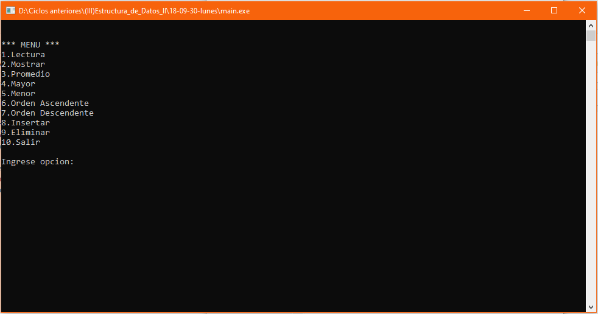

# Manejo de números
Sistema de manejo de un conjunto de números que permite ingresar números, mostrar los números ingresados, promediar el conjunto de números, mostrar el mayor o menor numero, ordenar el conjunto de números ascendente o descendente, insertar o eliminar un número en una posición indicada, **30/09/18**.

<strong>Imagen:</strong> Menú principal.

